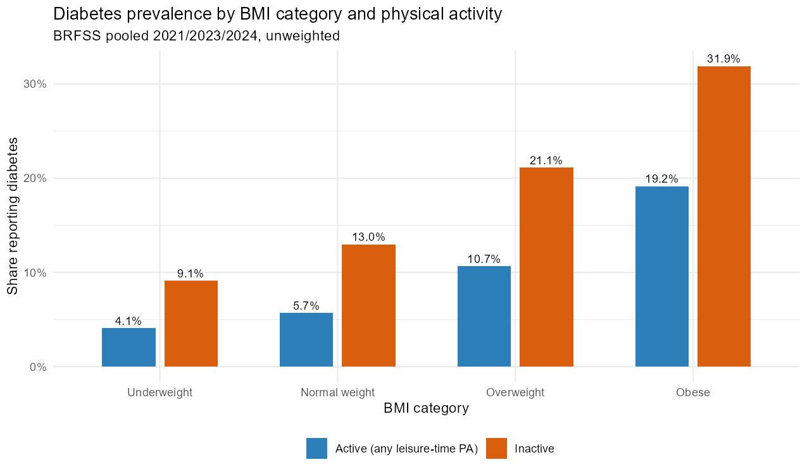
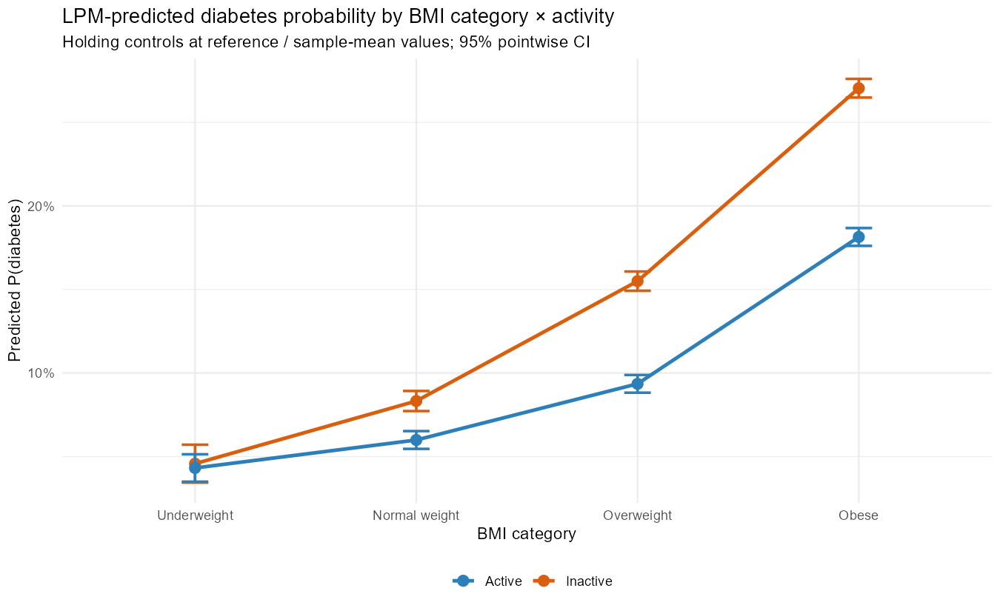

```{r setup, include=FALSE}
knitr::opts_chunk$set(
  echo = FALSE, message = FALSE, warning = FALSE,
  fig.align = "center", out.width = "85%", fig.pos = "H"
)
suppressMessages({
  library(dplyr)
  library(sandwich)
  library(lmtest)
  library(modelsummary)
})

# Load pre-built analysis sample (produced by 01_clean_data.R + 04_analysis.R)
analysis <- readRDS("output/analysis_sample.rds")

# Fit headline models inline (fast: ~30s total for all six)
m1 <- lm(diabetes ~ over_obese, data = analysis)
m2 <- lm(diabetes ~ over_obese + age + female + factor(race) +
           factor(income) + factor(educ) + current_smoker, data = analysis)
m3 <- lm(diabetes ~ over_obese + age + female + factor(race) +
           factor(income) + factor(educ) + current_smoker +
           state_fe + year_fe, data = analysis)
m4 <- lm(diabetes ~ over_obese * active + age + female + factor(race) +
           factor(income) + factor(educ) + current_smoker +
           state_fe + year_fe, data = analysis)
logit_h <- glm(diabetes ~ over_obese * active + age + female + factor(race) +
                 factor(income) + factor(educ) + current_smoker +
                 state_fe + year_fe, data = analysis,
               family = binomial("logit"))
m4_w <- lm(diabetes ~ over_obese * active + age + female + factor(race) +
             factor(income) + factor(educ) + current_smoker +
             state_fe + year_fe, data = analysis, weights = survey_weight)

# Cluster-robust VCV at state level
cluster_vcov <- function(model) vcovCL(model, cluster = ~state_fips, type = "HC1")
v1 <- cluster_vcov(m1); v2 <- cluster_vcov(m2)
v3 <- cluster_vcov(m3); v4 <- cluster_vcov(m4)
v_logit <- cluster_vcov(logit_h); v_w <- cluster_vcov(m4_w)

# Average marginal interaction from the logit (averaged across the empirical sample)
nd <- analysis
nd$over_obese <- 0; nd$active <- 0; p00 <- predict(logit_h, newdata = nd, type = "response")
nd$active <- 1;                       p01 <- predict(logit_h, newdata = nd, type = "response")
nd$over_obese <- 1; nd$active <- 0;   p10 <- predict(logit_h, newdata = nd, type = "response")
nd$active <- 1;                       p11 <- predict(logit_h, newdata = nd, type = "response")
ame_logit_norm  <- mean(p01 - p00)   # probability change normal: active - inactive
ame_logit_obese <- mean(p11 - p10)
ame_logit_int   <- ame_logit_obese - ame_logit_norm  # average marginal interaction
ame_lpm_int     <- coef(m4)["over_obese:active"]      # LPM AME = β3 by construction
```

## Abstract {-}

This paper asks whether physical activity attenuates the obesity-diabetes association using 1.33 million observations from the 2021, 2023, and 2024 waves of the Behavioral Risk Factor Surveillance System (BRFSS). Our unit of observation is the adult respondent. We estimate linear probability and logit models with state and year fixed effects and state-clustered standard errors, focusing on the cross-sectional association between overweight/obesity, leisure-time physical activity, and self-reported diabetes. In the linear probability model the over/obese × active interaction coefficient is -6.9 percentage points (SE 0.003, t = -26.6); the implied gap between active and inactive over/obese respondents is -8.9 percentage points (joint Wald F > 1000, p < 0.001), holding demographics, smoking, and state/year fixed effects constant. The same data fit with a logit yields a near-zero interaction on the log-odds scale (-0.007, p = 0.69), implying activity scales the odds of diabetes by approximately $\exp(-0.51) \approx 0.60$ at both weight levels. The logit's average marginal interaction across the empirical covariate distribution is about -3.5 pp - smaller than the LPM's -6.9 pp. The two models thus genuinely disagree on the magnitude of the absolute interaction, not on its sign: the LPM is fitting a steeper-than-logistic additive gradient. Robustness checks using the 2023 CDC Physical Activity Guideline measure, continuous BMI, survey weights, and pre-diabetes as a secondary outcome all reinforce the qualitative pattern. The gradient is similar across the 2021/2023/2024 waves - a cross-wave stability check, not a test of COVID's effect on incident diabetes (the outcome is lifetime-ever-diagnosed prevalence).

# Introduction

Obesity and physical inactivity are the two most-cited modifiable risk factors for type 2 diabetes (Aune et al., 2015). Whether they act independently - so that exercise can substantially offset the diabetes risk imposed by excess weight - is one of the longest-running debates in lifestyle epidemiology. The "fat but fit" hypothesis holds that physical activity meaningfully attenuates the cardiometabolic consequences of obesity, supporting a clinical and policy emphasis on movement even where weight loss is not achieved. The "metabolically healthy obese" (MHO) literature provides indirect tests of this view; recent meta-analyses (Bell et al., 2014; Kramer et al., 2013) generally find that even MHO adults face elevated diabetes and cardiovascular risk relative to metabolically healthy normal-weight peers - results that qualify, rather than support, a strong fat-but-fit attenuation claim. Counter-evidence in large-sample US data holds that obesity's effect on diabetes is so dominant that exercise provides only modest, non-attenuating reductions in risk (Abernethy et al., 2025).

The most recent large-sample US study, Abernethy, Bennie and Pavey (2025), pools BRFSS 2011-2019 and concludes that "PA provided modest reductions in the prevalence of diabetes but did not attenuate the detrimental impact of overweight and increasing levels of obesity on diabetes prevalence" (Abernethy et al., 2025, p. 1). Their analysis uses Poisson log-linear regression reporting adjusted prevalence ratios - a *multiplicative* model. Our paper updates their data through the 2024 wave, and uses the linear probability and logit models taught in this course to ask a sharper version of the question: does the empirical conclusion about attenuation depend on whether we measure it in absolute (LPM) or relative (logit/Poisson) terms?

Our research questions:

1. **Headline:** Conditional on state, year, age, sex, race, income, education, and smoking, is the interaction between overweight/obesity and physical activity in predicting diabetes statistically and economically meaningful?
2. **Methodological:** Does the sign and magnitude of the interaction depend on whether we estimate a linear probability model (additive in probability) or a logit model (additive in log-odds)?
3. **Cross-wave stability:** Is the obesity × activity gradient similar across the 2021, 2023, and 2024 BRFSS waves? (We note up front that the outcome is *lifetime-ever-diagnosed* diabetes, which responds slowly to contemporaneous lifestyle shocks; this is therefore a cross-wave stability check on the pattern, not a test of COVID's effect on diabetes incidence.)

We make three contributions. The first is simply timeliness: we re-estimate the obesity-activity-diabetes interaction on the most recent BRFSS data, 1.33 million observations across three years. The more interesting contribution is a methodological one. Comparing the LPM against the logit on the same data turns up a genuine disagreement about the *magnitude* of the interaction. The LPM puts it at 6.9 pp on the probability scale; the logit — which freely estimates the over_obese × active term and finds it indistinguishable from zero on the log-odds scale, implying a roughly constant activity odds-ratio across weight groups — implies only about 3.5 pp once averaged over the empirical covariate distribution. Finally, we confirm that this cross-sectional gradient holds steady across the 2021, 2023, and 2024 waves.

# Data

## Source and sample

We use the public-use microdata of the Behavioral Risk Factor Surveillance System (BRFSS) for survey years 2021, 2023, and 2024 (CDC, 2024). BRFSS is an ongoing state-based, random-digit-dialed telephone survey of non-institutionalized US adults age 18 and over. The 2021, 2023, and 2024 waves use the same iterative-proportional-fitting weighting methodology adopted in 2011, and CDC's own comparability documentation states that estimates from 2011 onward are directly comparable (CDC, 2024). Each respondent contributes one row.

We restrict to respondents with non-missing values on (i) the diabetes outcome (excluding pregnancy-only diabetes and "don't know"/refused responses); (ii) BMI and the BRFSS-calculated overweight-or-obese flag `_RFBMI5`; (iii) the leisure-time physical activity calculated variable `_TOTINDA`; and (iv) demographic and socioeconomic controls (age, sex, race/ethnicity, household income, education, and smoking status). Table \ref{tab:waterfall} shows the sample-restriction waterfall. The final analysis sample is **931,829 adults**.

\begin{table}[H]
\centering
\caption{\label{tab:waterfall}Sample-restriction waterfall}
\small
\begin{tabular}{lrr}
\toprule
Restriction & N & \% retained \\
\midrule
Pooled BRFSS 2021 + 2023 + 2024                          & 1,329,686 & 100.0 \\
Non-missing diabetes outcome                             & 1,284,384 & 96.6 \\
+ Non-missing BMI / overweight-or-obese                  & 1,159,111 & 87.2 \\
+ Non-missing leisure-time physical activity             & 1,156,579 & 87.0 \\
+ Non-missing demographic and SES controls               & 931,829   & 70.1 \\
\bottomrule
\end{tabular}
\end{table}

The cleaning audit flagged two data-quality issues worth noting. Kentucky (FIPS 21) and Pennsylvania (FIPS 42) did not meet BRFSS minimum requirements in 2023 and drop out of that year's public-use file (CDC, 2024); the state fixed effects absorb this mechanically. The second issue shaped our choice of activity measure. The BRFSS PA Module that carries the CDC guideline variables (`_PAINDX3`, `_PAREC3`) was fielded only in 2023 across our three years, so the pooled analysis relies on the binary `_TOTINDA` ("any leisure-time activity in past 30 days"), which is available in all three. The richer guideline variables reappear in a 2023-only robustness check.

## Key variables

The outcome variable is **`diabetes`**, an indicator equal to 1 if the respondent answered "yes" to the BRFSS question "(Ever told) (you had) diabetes?" (`DIABETE4` = 1), 0 if "no" (`DIABETE4` = 3). Respondents who reported diabetes only during pregnancy (`DIABETE4` = 2) or pre-diabetes (`DIABETE4` = 4) are excluded from the headline outcome; we use pre-diabetes as a secondary outcome below.

The main weight variable is **`over_obese`**, the BRFSS-calculated `_RFBMI5` indicator (1 if BMI > 25, 0 otherwise). We also use continuous BMI and the 4-category BMI classification as robustness alternatives.

The main physical-activity variable is **`active`**, the BRFSS-calculated `_TOTINDA` (1 if respondent reported any leisure-time physical activity in the past 30 days, 0 if none). In the 2023 robustness sub-sample we additionally use **`meets_aerobic`** = `_PAINDX3` (1 if meets the CDC 150-minute aerobic guideline), and the 4-category recommendation indicator **`pa_recommend_cat`** = `_PAREC3` (Neither / Strength only / Aerobic only / Both).

Controls include age (continuous, top-coded at 80), sex (`_SEX`), race/ethnicity (8 categories from `_RACE`), household income (7 categories from `_INCOMG1`), education (4 categories from `_EDUCAG`), and current-smoker status (derived from `_SMOKER3`).

## Descriptive evidence

Across the pooled sample, 14.3% of respondents report diabetes. The unweighted prevalence rises monotonically with BMI category: 5.6% (underweight), 7.0% (normal), 12.8% (overweight), 23.1% (obese). Figure \ref{fig:headline} displays the headline two-way comparison: diabetes prevalence by BMI category × physical activity. The cross-sectional gap between active and inactive widens with BMI category: 5 pp among underweight respondents (4.1% vs. 9.1%), 7 pp among normal-weight (5.7% vs. 13.0%), 10 pp among overweight (10.7% vs. 21.1%), and 13 pp among the obese (19.2% vs. 31.9%). This is the visual interaction the paper formalizes. (Underweight makes up only 1.5% of the sample and likely contains reverse-causation cases such as illness-related weight loss; we therefore do not lean on the underweight cell in the formal results.)

```{r fig-headline, fig.cap="\\label{fig:headline}Diabetes prevalence by BMI category and physical activity, BRFSS pooled 2021/2023/2024 (unweighted)."}

```

# Empirical strategy

## Specification

For respondent $i$ in state $s$ and year $t$, the headline linear probability model is

$$
\text{diabetes}_{ist} = \beta_0 + \beta_1 \, \text{OverObese}_{i} + \beta_2 \, \text{Active}_{i} + \beta_3 \, \text{OverObese}_{i} \times \text{Active}_{i} + \mathbf{X}_{i}'\boldsymbol{\gamma} + \alpha_{s} + \tau_{t} + \varepsilon_{ist},
$$

where $\text{diabetes}_{ist}$ is the binary diabetes indicator; $\text{OverObese}_{i}$ and $\text{Active}_{i}$ are the binary indicators defined above; $\mathbf{X}_{i}$ is the vector of demographic and SES controls (age, female, race factors, income factors, education factors, current-smoker); $\alpha_{s}$ is a state fixed effect (50 states + DC + territories, less the two states absent from 2023); $\tau_{t}$ is a survey-year fixed effect (2021, 2023, 2024); and $\varepsilon_{ist}$ is the error term.

The coefficient of interest is $\beta_3$, the interaction. A negative $\beta_3$ means that being active reduces the *additional* diabetes probability associated with overweight or obesity. The total marginal effect of being active for an over/obese respondent is $\beta_2 + \beta_3$; for a normal-weight respondent it is $\beta_2$.

We lead with the LPM for two reasons. Its coefficients are in natural units — percentage points of diabetes probability — so the magnitudes line up directly against clinical and policy benchmarks (Lecture 16). It also lets us contrast our estimates against the multiplicative-form Poisson model of Abernethy et al. (2025), the precedent paper for our question.

We re-estimate the same specification as a logit (Lecture 17) to test whether the interaction sign and magnitude depend on functional form, and translate the logit's log-odds coefficients into probability-scale interactions both at a representative covariate cell and via the average marginal effect (AME) over the empirical distribution.

## Identification and inference

We do not claim causal identification, and we report all results as associations rather than effects. Both BMI and physical activity are endogenous lifestyle choices, and reverse causality runs in both directions: a diabetes diagnosis can prompt weight loss (which moves a respondent from "obese" to "overweight" or "normal") *and* increased exercise (which moves them from "inactive" to "active"). Because both the exposure and the moderator can change post-diagnosis, the net bias on the interaction term is ambiguous in sign — we cannot honestly call our estimate a lower bound. Self-selection on unobservables (motivated, health-conscious respondents being both more active and at lower diabetes risk through unmeasured channels such as diet and sleep) cannot be ruled out, though adding observable controls progressively (Models 1 to 3 below) does not substantially shrink the average over/obese effect, suggesting the relevant unobservables would have to be largely uncorrelated with the included demographics and SES variables. We discuss specific limitations in the Conclusion.

Standard errors are clustered at the state level (53 clusters in the pooled sample), following Lecture 16. This accounts for the within-state correlation induced by BRFSS's complex sample design (stratified by state, with PSUs and weights). Although fully model-based inference for BRFSS would use the survey-design variables `_LLCPWT`, `_PSU`, and `_STSTR` in a Horvitz-Thompson framework, the state-clustered SE provides a conservative approximation appropriate to the course material.

# Results

## Headline LPM and logit

Table 2 presents the four-step LPM build-up (Models 1-4) together with the logit (Model 5) and survey-weighted LPM (Model 6) estimates of the headline interaction model.

```{r tab-main}
modelsummary(
  list("(1) Baseline" = m1,
       "(2) +Controls" = m2,
       "(3) +State & Year FE" = m3,
       "(4) +Interaction" = m4,
       "(5) Logit" = logit_h,
       "(6) Weighted" = m4_w),
  vcov = list(v1, v2, v3, v4, v_logit, v_w),
  stars = c('*'=0.10, '**'=0.05, '***'=0.01),
  coef_map = c(
    "over_obese"          = "Overweight or Obese",
    "active"              = "Active",
    "over_obese:active"   = "Over/Obese × Active",
    "age"                 = "Age",
    "female"              = "Female",
    "current_smoker"      = "Current smoker"
  ),
  gof_map = c("nobs","r.squared","adj.r.squared"),
  title = "Headline regression results. State-clustered SEs in parentheses.",
  notes = "Race, income, education factors, and state and year FE included but suppressed for space.",
  output = "kableExtra"
) |> kableExtra::kable_styling(latex_options = c("hold_position","scale_down"), font_size = 8)
```

The level effect of overweight/obesity is large and holds steady across Models 1-3, which estimate the *average* over/obese effect: 10.8 → 9.4 → 9.2 pp as controls and fixed effects are added. It then jumps to 14.3 pp in Model 4, but that is not a sudden change in the estimate — Model 4 introduces activity and the interaction at once, so 14.3 pp is the over/obese effect *among the inactive*, a different quantity. What we found reassuring is how little the average effect moves once state and year fixed effects enter (9.4 → 9.2 pp). Geographic and temporal composition, in other words, explain almost none of the gradient.

The interaction itself is negative, large, and tightly estimated: $\hat{\beta}_3 = -0.069$ (SE 0.003, t = -26.6, p < 0.001). Activity is associated with a 6.9 pp smaller over/obese marginal effect. Adding the level effect of activity ($\hat{\beta}_2 = -0.020$), the total cross-sectional gap between active and inactive over/obese respondents is **-8.9 percentage points**, against just **-2.0 pp** for a normal-weight respondent. The joint hypothesis $\beta_2 + \beta_3 = 0$ is rejected overwhelmingly (Wald F > 1000, p < 0.001).

The interesting part is what happens when we fit the *same data* with a logit. The over/obese × active term is freely estimated and comes back indistinguishable from zero on the log-odds scale (-0.007, SE 0.018, p = 0.69). That near-zero coefficient implies a roughly constant odds-ratio of $\exp(-0.51) \approx 0.60$ for activity at both weight levels — but note the constancy is something the model *finds*, not something it assumes. Table 3 makes the contrast concrete, reporting the four predicted cell probabilities under each model at a representative covariate cell (white respondent, mid-income, mid-education, California 2023; age, sex, and smoking at sample means). The within-cell probabilities are similar across the two models. Their probability-scale interactions are not: 6.9 pp for the LPM (= 8.96 − 2.05), 3.58 pp for the logit (= 6.16 − 2.58).

The LPM interaction is constant by construction — its value is $\hat{\beta}_3$ regardless of covariates. The logit interaction is not: it depends on the baseline probability, growing as the baseline rises. The cell in Table 3 is a relatively low-risk reference, so we also compute an average marginal interaction (AME) across the empirical covariate distribution, predicting under each $(\text{over\_obese}, \text{active})$ counterfactual for every respondent and averaging the difference-of-differences. The LPM's AME interaction is identical to its $\hat{\beta}_3 = -6.91$ pp by construction; the logit's AME interaction is `r sprintf("%.2f", 100*ame_logit_int)` pp — close to the cell-specific 3.58 pp and well below the LPM's 6.9 pp. The disagreement on magnitude survives the choice of evaluation point.

```{r tab-cells}
new_pp <- expand.grid(over_obese = c(0,1), active = c(0,1)) |>
  mutate(age            = mean(analysis$age, na.rm = TRUE),
         female         = mean(analysis$female, na.rm = TRUE),
         current_smoker = mean(analysis$current_smoker, na.rm = TRUE),
         race           = factor("White",          levels = levels(analysis$race)),
         income         = factor("5_50-100k",      levels = levels(analysis$income)),
         educ           = factor("3_Some college", levels = levels(analysis$educ)),
         state_fe       = factor("6",              levels = levels(analysis$state_fe)),
         year_fe        = factor("2023",           levels = levels(analysis$year_fe)))
new_pp$P_LPM   <- predict(m4,      newdata = new_pp)
new_pp$P_Logit <- predict(logit_h, newdata = new_pp, type = "response")
cells <- data.frame(
  Cell          = c("Normal/Under, Inactive","Over/Obese, Inactive",
                    "Normal/Under, Active",  "Over/Obese, Active"),
  `LPM P(diab)`   = sprintf("%.1f%%", 100*new_pp$P_LPM),
  `Logit P(diab)` = sprintf("%.1f%%", 100*new_pp$P_Logit),
  check.names = FALSE
)
deltas <- data.frame(
  Cell = c("Active reduction, Normal","Active reduction, Over/Obese",
           "Probability-scale interaction"),
  `LPM P(diab)`   = c(sprintf("%.2f pp", 100*(new_pp$P_LPM[1]-new_pp$P_LPM[3])),
                      sprintf("%.2f pp", 100*(new_pp$P_LPM[2]-new_pp$P_LPM[4])),
                      sprintf("%.2f pp", 100*((new_pp$P_LPM[2]-new_pp$P_LPM[4]) -
                                              (new_pp$P_LPM[1]-new_pp$P_LPM[3])))),
  `Logit P(diab)` = c(sprintf("%.2f pp", 100*(new_pp$P_Logit[1]-new_pp$P_Logit[3])),
                      sprintf("%.2f pp", 100*(new_pp$P_Logit[2]-new_pp$P_Logit[4])),
                      sprintf("%.2f pp", 100*((new_pp$P_Logit[2]-new_pp$P_Logit[4]) -
                                              (new_pp$P_Logit[1]-new_pp$P_Logit[3])))),
  check.names = FALSE
)
out <- rbind(cells, deltas)
kableExtra::kbl(out,
                caption = "\\label{tab:cells}LPM vs. logit predicted P(diabetes) at a representative covariate cell (white, mid-income, mid-education, CA 2023; age/sex/smoking at sample means), with implied active-vs-inactive reductions and probability-scale interaction.",
                booktabs = TRUE,
                align = "lcc") |>
  kableExtra::kable_styling(latex_options = c("hold_position"), font_size = 9) |>
  kableExtra::pack_rows("Predicted probabilities", 1, 4) |>
  kableExtra::pack_rows("Implied differences", 5, 7)
```

So the two models agree on sign but the LPM yields roughly twice the probability-scale interaction. Whether physical activity "attenuates" obesity ends up depending on functional form: the LPM answers the clinical question (absolute pp reductions for higher-baseline-risk patients), the logit the standard epidemiological one (odds-ratio scaling). Weighting changes little — the survey-weighted LPM in column 6 recovers nearly the same interaction (-0.062 vs. -0.069), so unweighted oversampling is not driving the result.

## Marginal effects \label{sec:mfx}

Figure \ref{fig:mfx} plots LPM-predicted P(diabetes) by BMI category × activity at sample-mean covariate values, using an extension of the headline model that replaces the binary `over_obese` with the 4-category BMI classification (`_BMI5CAT`). The widening gap between active and inactive across BMI categories is the visual signature of the interaction. Confidence intervals are tight because of the sample size, and the lines diverge clearly from the overweight category onward.

```{r fig-mfx, fig.cap="\\label{fig:mfx}LPM-predicted probability of diabetes by BMI category and activity status. Controls held at sample means / reference categories. Vertical bars are 95\\% pointwise confidence intervals."}

```

# Robustness and heterogeneity

Table 4 reports six robustness specifications. All point estimates of the over/obese × active interaction are negative and significant at the 1% level under the LPM.

```{r robust-models}
# 2023 PA guideline robustness
d23 <- analysis |> filter(year == 2023, !is.na(meets_aerobic))
m_pa  <- lm(diabetes ~ over_obese * meets_aerobic + age + female + factor(race) +
              factor(income) + factor(educ) + current_smoker + state_fe, data = d23)
# Continuous BMI
ab <- analysis |> filter(!is.na(bmi))
m_bmi <- lm(diabetes ~ bmi * active + age + female + factor(race) +
              factor(income) + factor(educ) + current_smoker +
              state_fe + year_fe, data = ab)
# Pre-diabetes secondary outcome
dp <- readRDS("clean/brfss_pooled.rds") |>
  filter(!is.na(prediabetes), !is.na(over_obese), !is.na(active),
         !is.na(age), !is.na(female), !is.na(race), !is.na(educ),
         !is.na(income), !is.na(current_smoker)) |>
  mutate(state_fe = factor(state_fips), year_fe = factor(year),
         race = factor(race), educ = factor(educ), income = factor(income))
m_pre <- lm(prediabetes ~ over_obese * active + age + female + factor(race) +
              factor(income) + factor(educ) + current_smoker +
              state_fe + year_fe, data = dp)
```

```{r tab-robust}
modelsummary(
  list("Headline LPM"     = m4,
       "Continuous BMI"   = m_bmi,
       "Survey-weighted"  = m4_w,
       "Pre-diabetes"     = m_pre,
       "2023 PA Guideline"= m_pa),
  vcov = list(v4,
              vcovCL(m_bmi, cluster = ~state_fips, type = "HC1"),
              v_w,
              vcovCL(m_pre, cluster = ~state_fips, type = "HC1"),
              vcovCL(m_pa,  cluster = ~state_fips, type = "HC1")),
  stars = c('*'=0.10,'**'=0.05,'***'=0.01),
  coef_map = c(
    "over_obese"                = "Over/Obese",
    "active"                    = "Active",
    "over_obese:active"         = "Over/Obese × Active",
    "bmi"                       = "BMI",
    "bmi:active"                = "BMI × Active",
    "meets_aerobic"             = "Meets 150-min Guideline",
    "over_obese:meets_aerobic"  = "Over/Obese × Meets Guideline"
  ),
  gof_map = c("nobs","r.squared"),
  title = "Robustness specifications.",
  notes = "State-clustered SEs in parentheses. Controls and state + year FE included but suppressed.",
  output = "kableExtra"
) |> kableExtra::kable_styling(latex_options = c("hold_position","scale_down"), font_size = 8)
```


**Continuous BMI.** Replacing the binary indicator with continuous BMI yields a positive main effect and a negative BMI × active interaction. The interaction is small per BMI unit (about -0.002), but integrated across the obese range (BMI 30-40) gives a -2 pp interaction. This is smaller than the binary -6.9 pp result, and the gap is informative: the binary "overweight or obese" indicator (BMI > 25) lumps a BMI-26 person with a BMI-40 person into one group, and the marginal-effects figure (Figure \ref{fig:mfx}) shows most of the absolute activity-by-weight gradient is concentrated in the obese tail. The continuous specification confirms the sign of the interaction but suggests the binary headline number reflects, in part, where the BMI distribution is densest within the "over_obese" bin.

**4-category BMI.** With the 4-level BMI classification, the interaction with activity grows monotonically in magnitude from Overweight × Active to Obese × Active, exactly as Figure \ref{fig:mfx} suggests.

**Survey-weighted.** Using `_LLCPWT` recovers a -6.2 pp interaction, very close to the unweighted -6.9 pp.

**Pre-diabetes outcome.** Re-coding the outcome as pre-diabetes (DIABETE4 = 4 or PREDIAB = 1) and excluding established diabetics, the over/obese × active interaction is also negative and significant, but meaningfully smaller in magnitude (about -1.6 pp vs. the headline -6.9 pp). This is consistent with two channels we cannot fully distinguish: (i) pre-diabetes has a lower baseline prevalence than diabetes, so a constant-odds-ratio logic predicts a smaller probability-scale interaction; (ii) part of the diabetes-side interaction may reflect post-diagnosis behavior change (over/obese diabetics being told to exercise) that has not yet propagated to the pre-diabetic stage, in which case the pre-diabetes estimate is closer to a clean cross-sectional association. The higher R² (0.26) reflects the different outcome base rate and the demographically narrower analytic sample, not a mechanical effect of sample size.

**2023 CDC physical-activity guideline.** Restricting to 2023 and using `meets_aerobic` (≥150 min/week) in place of `_TOTINDA` yields a -4.8 pp interaction (SE 0.004, t = -13.7), nearly as large as the binary measure despite the much sharper definition. The 4-category recommendation variable (`_PAREC3`) gives a clean dose-response: among over/obese adults, "Both aerobic + strength" is associated with a -6.9 pp diabetes-rate reduction versus "Neither"; "Aerobic only" -5.5 pp; "Strength only" -4.2 pp. The ordering is monotonic and matches CDC's clinical recommendation.

## Cross-wave stability

We also verify that the obesity × activity gradient is similar across the three BRFSS waves. A three-way interaction `OverObese × Active × Year` (vs. 2021 baseline) gives -0.003 (SE 0.005, p = 0.51) for 2023 and +0.004 (SE 0.006, p = 0.45) for 2024; the joint Wald test fails to reject H~0~: stable gradient (p > 0.4). This is a cross-wave consistency check on the pooled estimate, not a test of COVID's effect on diabetes — the outcome is lifetime-ever-diagnosed prevalence, which in a roughly fixed adult population responds slowly to contemporaneous lifestyle shocks.

## Race/ethnicity heterogeneity

Three-way interactions with the four largest racial/ethnic groups (White, Black, Hispanic, Asian) test whether the over/obese × active interaction itself differs by race. The pattern is broadly similar (within-race interaction between -0.05 and -0.08); the Asian × OverObese × Active triple coefficient is significant but small. Taken at face value, the additive attenuation by activity is modestly *weaker* among Asian respondents than among White respondents (the triple interaction measures a difference of differences, not a level shift). Two non-exclusive readings: the BMI > 25 threshold is miscalibrated for Asian populations (WHO recommends ~23), so BRFSS "Normal-weight" Asian respondents disproportionately include at-risk individuals; and/or the underlying gradient differs for Asian Americans, who face elevated diabetes risk at any given BMI (Hsu et al., 2015).

# How AI helped this project

Following the example in our course's empirical-project guide, we used Anthropic's Claude as a research collaborator across multiple stages of the project. Three uses were substantive:

1. **Literature mapping.** A first prompt - "Has anyone tested whether physical activity attenuates the obesity-diabetes association using large US population data?" - returned the Abernethy et al. (2025) paper that became our direct precedent, plus the foundational Bell et al. (2014) and Kramer et al. (2013) meta-analyses on metabolically healthy obesity. We verified each citation independently before including it.

2. **Variable selection in the BRFSS codebook.** BRFSS has roughly 300 columns. We asked Claude to cross-check across the 2021, 2023, and 2024 codebooks which variables for diabetes, BMI, physical activity, and demographic controls were *consistently coded* across all three years versus only present in one. The output flagged that the detailed Physical Activity Module (`_PAINDX3`, `_PAREC3`) was fielded only in 2023 - guiding our decision to use the binary `_TOTINDA` for the pooled headline and the richer guideline measures as a 2023-only robustness check.

3. **R-code drafting and debugging.** Claude wrote a first draft of the cleaning pipeline (the `01_clean_data.R` script in our appendix), which we then audited line-by-line. We modified the diabetes outcome construction to explicitly exclude pregnancy-only and pre-diabetic respondents (rather than treating them as missing-at-random), and we replaced an initial pandas-style merge with an R `bind_rows` approach more compatible with `dplyr`. We also asked Claude to suggest a marginal-effects plot specification; the resulting `predict()`-based version (Figure \ref{fig:mfx}) is what appears in the paper.

The choice of econometric specification - LPM versus logit, the inclusion of state and year fixed effects, the cluster-robust SE at state level - was made by the authors based on the course material, not by Claude. We did, however, use Claude to verify that the cluster-robust SE implementation (`sandwich::vcovCL`) returned numerically equivalent results to the cluster-bootstrap approach demonstrated in Lecture 16.

# Conclusion

Using 1.33 million observations from BRFSS 2021/2023/2024 with the empirical methods taught in this course, we document a large negative cross-sectional association between the obesity × activity interaction and self-reported diabetes on the additive (LPM) scale ($\hat{\beta}_3 = -6.9$ pp), while the same data fit with a logit yield a log-odds interaction indistinguishable from zero — translating to an average probability-scale interaction of roughly $-3.5$ pp across the empirical covariate distribution. The two specifications agree on sign but disagree on magnitude by a factor of roughly two; the LPM is fitting a steeper-than-logistic additive gradient. Abernethy et al.'s (2025) "no attenuation" result is consistent with the logit reading; our LPM result is consistent with the additive reading. The cross-sectional gradient is similar across the three BRFSS waves.

Two limitations are specific enough to this dataset to be worth stating plainly. BMI and diabetes status are both self-reported, and CDC's own validation work documents systematic underreporting of body weight in telephone interviews (Pierannunzi et al., 2013); if that under-reporting is correlated with activity status, our LPM interaction could be partly artifactual. NHANES — which measures BMI directly and diagnoses diabetes by HbA1c — would let us calibrate a population-level measurement-error correction, though as an independent sample it cannot be linked to BRFSS at the individual level. The other limitation is selection: listwise deletion on income drops roughly 18 pp of the sample at the SES-control step. Re-running without income controls leaves the interaction almost unchanged (-0.067 vs. -0.069), which is reassuring, but the missingness is non-random in BRFSS and the caveat stands.

\newpage

# References {-}

Abernethy, D., Bennie, J., & Pavey, T. (2025). Joint Effects of Physical Activity and Body Mass Index on Prevalent Diabetes in a Nationally Representative Sample of 1.9 Million US Adults. *Journal of Diabetes Research*, 2025:7466757. https://doi.org/10.1155/jdr/7466757

Aune, D., Norat, T., Leitzmann, M., et al. (2015). Physical activity and the risk of type 2 diabetes: a systematic review and dose-response meta-analysis. *European Journal of Epidemiology*, 30(7), 529-542.

Bell, J. A., Kivimaki, M., & Hamer, M. (2014). Metabolically healthy obesity and risk of incident type 2 diabetes: a meta-analysis of prospective cohort studies. *Obesity Reviews*, 15(6), 504-515.

Centers for Disease Control and Prevention. (2024). *Behavioral Risk Factor Surveillance System Comparability of Data: BRFSS 2023*. Atlanta, GA: U.S. Department of Health and Human Services.

Hsu, W. C., Araneta, M. R. G., Kanaya, A. M., et al. (2015). BMI cut points to identify at-risk Asian Americans for type 2 diabetes screening. *Diabetes Care*, 38(1), 150-158.

Kramer, C. K., Zinman, B., & Retnakaran, R. (2013). Are metabolically healthy overweight and obesity benign conditions? A systematic review and meta-analysis. *Annals of Internal Medicine*, 159(11), 758-769.

Pierannunzi, C., Hu, S. S., & Balluz, L. (2013). A systematic review of publications assessing reliability and validity of the Behavioral Risk Factor Surveillance System (BRFSS), 2004-2011. *BMC Medical Research Methodology*, 13, 49.

Stenholm, S., Head, J., Kivimäki, M., et al. (2017). Smoking, physical inactivity and obesity as predictors of healthy and disease-free life expectancy between ages 50 and 75: a multi-cohort study. *International Journal of Epidemiology*, 46(3), 911-919.

U.S. Department of Health and Human Services. (2018). *Physical Activity Guidelines for Americans*, 2nd edition. Washington, DC: HHS.

\newpage

# Code appendix {-}

The full reproducible R code is in the accompanying scripts `01_clean_data.R` (cleaning and harmonization), `02_sanity_check.R` (descriptive checks), `03_quality_audit.R` (missingness and figures), and `04_analysis.R` (regressions, tables, marginal effects). All four scripts execute end-to-end on the public-use BRFSS 2021/2023/2024 XPT files. The complete listing follows.

```{r echo=FALSE, results="asis"}
files <- c("01_clean_data.R","02_sanity_check.R","03_quality_audit.R","04_analysis.R")
for (f in files) {
  # Escape underscores for LaTeX subsection name
  f_safe <- gsub("_", "\\\\_", f, fixed = FALSE)
  cat("\n\\subsection*{", f_safe, "}\n", sep="")
  cat("\n```r\n")
  cat(readLines(f), sep="\n")
  cat("\n```\n")
}
```
